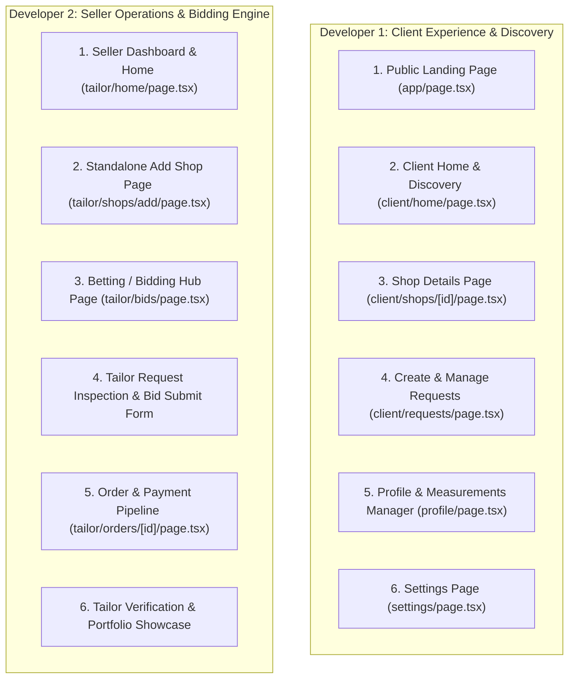

# Fiti Frontend - Login Implementation Audit & Task Division Document

**Project:** Fiti Marketplace (Custom Clothing & Tailoring Platform)  
**Location:** `Fiti-Frontend`  
**Document Target:** `Fiti/Docs/Tasks/FRONTEND_LOGIN_AND_TASK_DIVISION.md`  
**Date:** August 19, 2026  

---

## Executive Summary

This document provides a comprehensive audit of the login and authentication implementation within the `Fiti-Frontend` codebase and outlines a balanced task division between **Developer 1** and **Developer 2** for completing the remaining 14 core frontend pages.

---

## Part 1: Login & Auth Implementation Audit

### 1. Architectural Overview & Context
The authentication flow in `Fiti-Frontend` utilizes **Firebase Auth SDK** for client-side authentication (Email/Password & Google OAuth) decoupled with a **FastAPI + PostgreSQL** backend as the source of truth for user roles (`client` vs `tailor`).

* **Auth Provider & State Management:** [`lib/firebase/AuthContext.ts`](file:///home/km/Developments/miniProject/Fiti-Frontend/lib/firebase/AuthContext.ts)  
  * Maintains reactive `user` (Firebase credentials + Firestore extra data) and `dbRole` (`"client"` | `"tailor"`).
  * On state changes (`onAuthStateChanged`), queries backend endpoint `GET /api/v1/auth/me/role` via [`lib/api/endpoints/auth.ts`](file:///home/km/Developments/miniProject/Fiti-Frontend/lib/api/endpoints/auth.ts).
  * Automatically handles `404` status from backend for newly registered OAuth users (flagging them for onboarding).
  * Syncs real-time user metadata from Firestore collection `users/{uid}`.
* **Global Provider Wrapping:** [`app/layout.tsx`](file:///home/km/Developments/miniProject/Fiti-Frontend/app/layout.tsx)  
  * Encloses the root application with `<AuthProvider>`.
* **Route Protection & Role Guard:** [`app/(protected)/layout.tsx`](file:///home/km/Developments/miniProject/Fiti-Frontend/app/%28protected%29/layout.tsx)  
  * Intercepts all routes under `(protected)`.
  * Redirects unauthenticated users (`!user`) to `/login`.
  * Redirects authenticated users missing a role (`!dbRole`) to `/onboarding`.
  * Strictly enforces role isolation: blocks clients from accessing `/tailor/*` (redirecting to `/client/home`) and tailors from accessing `/client/*` (redirecting to `/tailor/home`).

---

### 2. Login Logic Distribution Across Pages

| Page / Component Path | Auth / Login Logic Added | Implementation Summary |
| :--- | :--- | :--- |
| **Login Page**<br>`app/(auth)/login/page.tsx` | **Full Auth Integration** | Handles Email/Password sign-in (`signInWithEmailAndPassword`) and Google OAuth popup (`signInWithPopup`). Invokes backend role verification (`getMyRole()`). Redirects to `/client/home`, `/tailor/home`, or `/onboarding`. |
| **Register Choice Page**<br>`app/(auth)/register/page.tsx` | **Auth Gateway** | Provides role selection UI directing users to role-specific registration paths (`/register/client` vs `/register/tailor`). |
| **Client Registration**<br>`app/(auth)/register/[role]/page.tsx`<br>`components/auth/register-forms.tsx` | **Full Registration & Auth** | Creates Firebase user (`createUserWithEmailAndPassword`), updates display name/photo, invokes backend API `createClientProfile()`, saves profile in Firestore, sets session role, and redirects to `/client/home`. |
| **Seller Registration**<br>`app/(auth)/register/[role]/page.tsx`<br>`components/auth/register-forms.tsx` | **Full Registration & Auth** | 2-step onboarding form. Step 1: Personal profile & location. Step 2: Shop details (`createShop`), specialty, NIC front/rear uploads, shop images (`addShopImage`). Creates Firebase user, backend tailor profile, sets session role, and redirects to `/tailor/home`. |
| **Onboarding Page**<br>`app/(auth)/onboarding/page.tsx` | **Fallback Auth & Setup** | Secondary gateway for Google OAuth sign-ups who lack backend profiles or roles. Uploads avatar/NIC/shop media to Cloudinary, calls `createClientProfile` or `createTailorProfile` + `createShop`, updates Firestore, and redirects to respective home. |
| **Protected Route Guard**<br>`app/(protected)/layout.tsx` | **Auth Protection Middleware** | Enforces active Firebase session, role existence, and route permissions for all nested seller/client pages. |

---

## Part 2: Page Implementation Status Matrix

The following matrix details the current status of all 14 requested pages:

| # | Page Name | Current Implementation Status | Existing File Location | Notes & Missing Features |
| :-: | :--- | :--- | :--- | :--- |
| **1** | **LOGIN PAGE** | ✅ **Implemented[NOT UI]** | `app/(auth)/login/page.tsx` | Complete with Email/Password, Google OAuth, error handling, backend role lookup, and redirect logic. |
| **2** | **REGISTER SELECTION PAGE** | ✅ **Implemented[NOT UI]** | `app/(auth)/register/page.tsx` | Complete with role selection cards (Client vs Tailor). |
| **3** | **CLIENT REGISTER PAGE** | ✅ **Implemented[NOT UI]** | `components/auth/register-forms.tsx`<br>`app/(auth)/register/[role]/page.tsx` | Complete form with name, email, phone, city, address, image placeholder, and backend `createClientProfile()` integration. |
| **4** | **SELLER REGISTER PAGE** | ✅ **Implemented[NOT UI]** | `components/auth/register-forms.tsx`<br>`app/(auth)/register/[role]/page.tsx` | Complete 2-step form: Personal details + Shop details, specialty, Leaflet map location picker (`LocationPicker`), NIC uploader, `createShop()` API. |
| **5** | **ADD SHOP PAGE** | ⚠️ **Partially Implemented** | Embedded in `components/auth/register-forms.tsx` | Shop creation logic (`createShop` API) exists inside registration. **Needs standalone page** at `/tailor/shops/add` for existing tailors to add additional shops. |
| **6** | **SELLER DASHBOARD** | 🔴 **Pending (Placeholder)** | `app/(protected)/tailor/home/page.tsx` | Currently shows basic placeholder text. Needs stats cards (Total Bids, Active Orders, Revenue, Pending Requests), quick action buttons, and order status charts. |
| **7** | **SELLER HOME PAGE** | 🔴 **Pending (Placeholder)** | `app/(protected)/tailor/home/page.tsx` | Currently shares placeholder with Seller Dashboard. Needs live feed of nearby marketplace requests, quick bid launcher, and shop status toggles. |
| **8** | **CLIENT HOME PAGE** | 🔴 **Pending (Placeholder)** | `app/(protected)/client/home/page.tsx` | Currently shows basic placeholder text. Needs shop discovery grid, category filters, search bar, nearby shops map view, and active clothing request progress tracker. |
| **9** | **SHOP DETAILS** | 🔴 **Pending (Not Created)** | Target: `app/(protected)/client/shops/[id]/page.tsx` | Needs shop profile hero, portfolio image gallery (`ShopImage`), specialty tags, customer ratings/reviews, shop location map, and "Request Custom Outfit" button. |
| **10** | **REQUEST DETAILS** | 🔴 **Pending (Not Created)** | Target: `app/(protected)/requests/[id]/page.tsx` | Needs detailed view of clothing request specs, reference images, body measurements, status timeline, and received bids list (for client) / submit bid modal (for tailor). |
| **11** | **BETTING PAGE** *(Bidding Hub)* | 🔴 **Pending (Not Created)** | Target: `app/(protected)/tailor/bids/page.tsx` | Needs marketplace request bidding feed for tailors. Form to submit competitive price quotes, delivery timelines, and custom notes (`submitBid` API). |
| **12** | **LANDING PAGE** | 🔴 **Pending (Redirect)** | `app/page.tsx` | Currently contains `redirect("/login")`. Needs full public landing page with hero banner, service introduction, verified tailors showcase, how-it-works guide, testimonials, and CTA buttons. |
| **13** | **PROFILE PAGE** | 🔴 **Pending (Not Created)** | Target: `app/(protected)/profile/page.tsx` | Needs profile viewer & editor. Personal contact details, avatar uploader, address, and client body measurement management tool (`updateMeasurements`, `getMeasurements`). |
| **14** | **SETTING PAGE** | 🔴 **Pending (Not Created)** | Target: `app/(protected)/settings/page.tsx` | Needs user preference controls: notification settings, password change/security, payment methods, theme toggles, and logout trigger. |

---

## Part 3: Task Division between 2 Developers

To maximize productivity and maintain clear responsibility separation, tasks are divided based on **Client Discovery & Experience (Developer 1)** vs **Seller Operations & Bidding System (Developer 2)**.



---

### 👨‍💻 DEVELOPER 1: Client Discovery, Public Marketing & User Profile

**Primary Focus:** Public site, client browsing, shop discovery, requesting clothing, client profile & measurements, settings.

#### Task List for Developer 1:

1. **Task 1.1: Public Landing Page (`app/page.tsx`)**
   * Replace redirect with an engaging marketing landing page.
   * Add Hero Banner with call-to-action buttons ("Find a Tailor", "Join as a Tailor").
   * Section for Platform Features (Custom Suits, Bridal Wear, Quick Alterations, Direct Bidding).
   * Showcase grid featuring top verified tailor shops.
   * "How It Works" step-by-step guide for clients.

2. **Task 1.2: Client Home & Shop Discovery Page (`app/(protected)/client/home/page.tsx`)**
   * Build interactive search bar (search by shop name, city, or specialty like "Bridal").
   * Implement shop category filter chips (Suits, Dresses, Casual, Alterations, Embroidery).
   * Integrate shop cards grid displaying shop name, city, specialty, rating, and thumbnail.
   * Add map toggle view using `LocationPicker` / Leaflet map to show nearby shops via `listNearbyShops()`.
   * Include quick action widget for "My Active Clothing Requests".

3. **Task 1.3: Shop Details Page (`app/(protected)/client/shops/[id]/page.tsx`)**
   * Build header with shop banner, profile picture, business registration badge, and verification status.
   * Display contact information, address, and interactive map location.
   * Portfolio Image Gallery fetched via shop details API (`getShop`).
   * Tailor bio, specialty tags, and customer ratings/reviews summary.
   * Primary action button: "Request Custom Quote / Order" opening the request modal.

4. **Task 1.4: Client Request Details & Bid Review Page (`app/(protected)/client/requests/[id]/page.tsx`)**
   * Display submitted request specifications (garment type, budget range, deadline, reference images, body measurements).
   * Build "Received Tailor Bids" list displaying tailor quotes, message, turnaround time, and shop profile link.
   * Add "Accept Bid" action button calling `acceptBid()` API endpoint to generate an active Order.
   * Add "Cancel Request" action button calling `cancelRequest()` API endpoint for open requests.

5. **Task 1.5: Profile & Body Measurements Page (`app/(protected)/profile/page.tsx`)**
   * User profile editor (Display Name, Avatar, Phone, City, Address).
   * Interactive Body Measurements Form for clients (Chest/Bust, Waist, Hips, Inseam, Shoulder Width, Arm Length, Neck) integrated with `updateMeasurements()` and `getMeasurements()`.
   * Photo upload handling for profile picture updates.

6. **Task 1.6: User Settings Page (`app/(protected)/settings/page.tsx`)**
   * Notification preferences (Email notifications for new bids, order updates).
   * Account Security section (Password change trigger via Firebase Auth).
   * Role info badge & option to request role change.
   * System preferences (Theme/Dark mode options).

---

### 👨‍💻 DEVELOPER 2: Seller Workspace, Shop Management & Bidding System

**Primary Focus:** Seller/Tailor dashboard, shop management, bidding hub, request evaluation, order pipeline management.

#### Task List for Developer 2:

1. **Task 2.1: Seller Dashboard & Home Page (`app/(protected)/tailor/home/page.tsx`)**
   * Build Tailor KPI Summary Cards:
     * Active Shop Requests Count
     * Submitted Bids Count
     * Orders in Progress Count
     * Completed Orders & Estimated Earnings
   * Quick Shop Status Banner (Online/Accepting Requests vs Busy).
   * "Recent Marketplace Requests" feed preview with direct "Place Bid" quick button.
   * Active Orders status pipeline preview.

2. **Task 2.2: Standalone Add & Edit Shop Page (`app/(protected)/tailor/shops/add/page.tsx` & `/shops/[id]/edit`)**
   * Standalone multi-step or single-page form for creating additional tailor shops or updating existing shop details.
   * Fields: Shop Name, Specialty, Bio, Contact Phone, City, Address, Registration Number.
   * Interactive Leaflet Map Picker (`LocationPicker`) for precise shop GPS coordinates (`latitude`, `longitude`).
   * Shop Portfolio Manager allowing tailors to upload & delete shop images (`addShopImage`).

3. **Task 2.3: Betting Page / Request Bidding Hub (`app/(protected)/tailor/bids/page.tsx`)**
   * Marketplace Request Feed listing all open client requests (`listOpenRequests()`).
   * Filter requests by City, Specialty, Budget, or Distance from tailor's shop.
   * Quick view card showing client's requested garment, budget, deadline, and number of existing bids.
   * Interactive **"Submit Bid" Form Modal**:
     * Proposed Price Quote ($ / LKR)
     * Estimated Days to Complete
     * Proposal Message / Fabric details
     * API integration with `submitBid()`.

4. **Task 2.4: Seller Request Details & Inspection Page (`app/(protected)/tailor/requests/[id]/page.tsx`)**
   * In-depth client request view for tailors.
   * Detailed breakdown of client body measurements (Bust, Waist, Hips, Inseam, etc.) to evaluate feasibility.
   * Attached inspiration photos / sketch viewer.
   * Bid status indicator (Shows existing bid if already submitted by tailor).

5. **Task 2.5: Order & Status Pipeline Management Page (`app/(protected)/tailor/orders/[id]/page.tsx`)**
   * View order details, agreed price, client contact details, and deadline.
   * Order Status Stepper & Updater (`updateOrderStatus` API):
     * `pending` ➔ `in_progress` ➔ `completed`
   * Payment status badge (`getOrderPayment` API).
   * Client rating & review display upon order completion.

6. **Task 2.6: Tailor Verification & Identity Management (`app/(protected)/tailor/verification/page.tsx`)**
   * Verification status card (`getTailorVerification` API).
   * Re-upload NIC Front / NIC Rear document interface for pending or unverified tailors.
   * Business registration badge manager.

---

## Part 4: API Endpoint Mapping Reference

To ensure seamless integration between the frontend pages and backend services, the developers should reference the pre-built API modules in `lib/api/endpoints/`:

```
lib/api/
├── client.ts                 <-- apiFetch utility with automatic Firebase Bearer Token
├── endpoints/
│   ├── auth.ts              <-- getMyRole()
│   ├── profiles.ts          <-- createClientProfile(), getClientProfile(), updateMeasurements(), getMeasurements(), createTailorProfile(), getTailorProfile(), getTailorVerification()
│   ├── shops.ts             <-- listShops(), listNearbyShops(), listTailorShops(), getShop(), createShop(), updateShop(), deleteShop(), addShopImage()
│   ├── orders.ts            <-- createClothingRequest(), listOpenRequests(), listClientRequests(), getClothingRequest(), cancelRequest(), listShopRequests(), listBidsOnRequest(), submitBid(), acceptBid(), listShopOrders(), listClientOrders(), getOrder(), updateOrderStatus(), getOrderPayment(), processMockPayment(), submitRating()
│   └── support.ts           <-- Support tickets API
└── types/                   <-- TypeScript interfaces for all payloads and responses
```

---

## Conclusion & Next Steps

1. **Documentation Location:** Saved in `Fiti/Docs/Tasks/FRONTEND_LOGIN_AND_TASK_DIVISION.md`.
2. **Implementation Order:**
   - **Sprint 1 (Core Navigation & Dashboards):** Developer 1 builds Landing Page & Client Home; Developer 2 builds Seller Dashboard & Bidding Hub.
   - **Sprint 2 (Details & Operations):** Developer 1 builds Shop Details & Client Request view; Developer 2 builds Add Shop & Request Inspection.
   - **Sprint 3 (Profiles & Pipelines):** Developer 1 builds Profile & Measurements; Developer 2 builds Order Pipeline & Verification.
