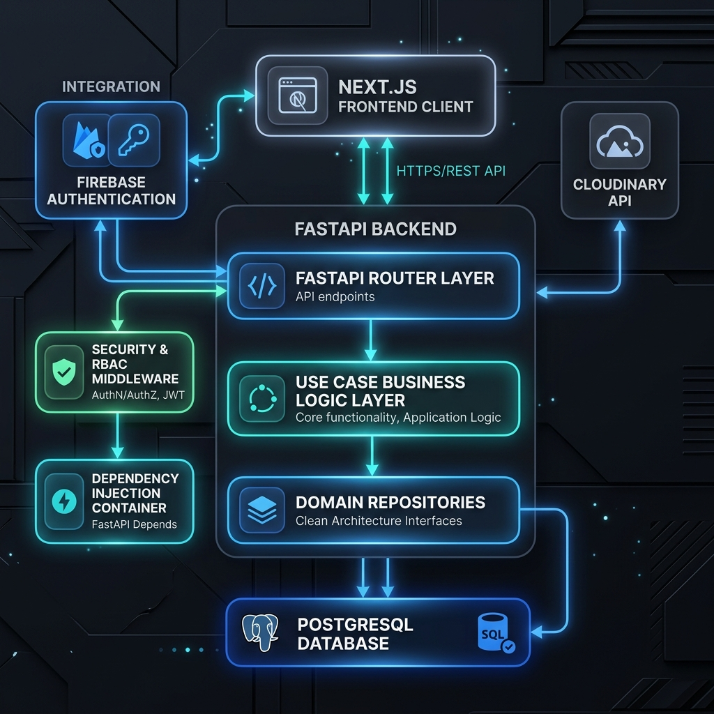
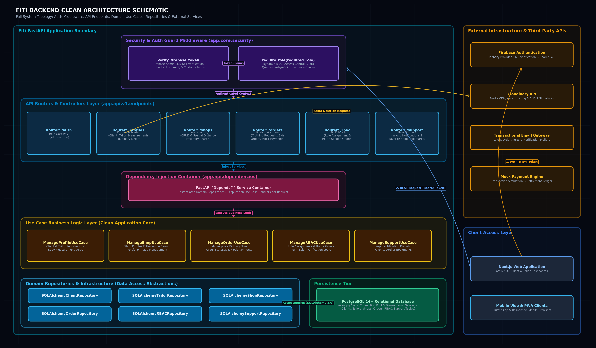

# Fiti FastAPI Backend Architecture & Functional Reference Documentation

## 1. Executive Summary & System Overview

The **Fiti** backend is a high-performance, asynchronous RESTful API built with **FastAPI** (Python 3.12+), **SQLAlchemy 2.0 (AsyncIO)**, **PostgreSQL 14+**, and **Firebase Admin SDK**. It powers the smart tailoring platform, connecting custom garment clients with professional tailoring ateliers.

The backend strictly adheres to **Clean Architecture / Domain-Driven Design (DDD)** principles, enforcing a clear separation of concerns across four key layers:

```
                  ┌──────────────────────────────────────────────────┐
                  │                 API / Router Layer               │
                  │   FastAPI Endpoints, Pydantic Schemas, Security  │
                  └────────────────────────┬─────────────────────────┘
                                           │
                                           ▼
                  ┌──────────────────────────────────────────────────┐
                  │              Use Case / Service Layer            │
                  │       Orchestrates Core Business Logic & DTOs     │
                  └────────────────────────┬─────────────────────────┘
                                           │
                                           ▼
                  ┌──────────────────────────────────────────────────┐
                  │            Domain Repositories Interfaces         │
                  │          Abstract Base Classes & Entities         │
                  └────────────────────────┬─────────────────────────┘
                                           │
                                           ▼
                  ┌──────────────────────────────────────────────────┐
                  │           Infrastructure / Persistence           │
                  │  SQLAlchemy Async Models & DB Repositories,      │
                  │       Firebase Admin, Cloudinary Integration     │
                  └────────────────────────┴─────────────────────────┘
```

---

## 2. System Architecture Diagrams

### High-Level System Architecture Overview


### Technical Blueprint & Data Flow Schematic


### Mermaid Architecture Code Block
```mermaid
graph TD
    subgraph Client Layer
        FE["Next.js Web Frontend / Client Application"]
    end

    subgraph External Authentication & Storage
        FA["Firebase Auth (Identity Provider)"]
        CL["Cloudinary API (Media CDN)"]
    end

    subgraph Fiti FastAPI Backend
        subgraph Security & Middleware
            AUTH["Firebase Token Verifier (get_current_user)"]
            RBAC_MW["RBAC Dependency (require_role)"]
            CORS["CORS Middleware"]
        end

        subgraph API Routers (/api/v1)
            R_AUTH["Auth Router (/auth)"]
            R_PROF["Profiles Router (/profiles)"]
            R_SHOP["Shops Router (/shops)"]
            R_ORD["Orders Router (/orders)"]
            R_RBAC["RBAC Router (/rbac)"]
            R_SUPP["Support Router (/support)"]
        end

        subgraph DI Container
            DEP["FastAPI Dependencies Container (dependencies.py)"]
        end

        subgraph Use Case Layer
            UC_PROF["ManageProfileUseCase"]
            UC_RBAC["ManageRBACUseCase"]
            UC_SHOP["ManageShopUseCase"]
            UC_ORD["ManageOrderUseCase"]
            UC_SUPP["ManageSupportUseCase"]
        end

        subgraph Infrastructure & Persistence Layer
            REPO_CLIENT["SQLAlchemyClientRepository"]
            REPO_TAILOR["SQLAlchemyTailorRepository"]
            REPO_SHOP["SQLAlchemyShopRepository"]
            REPO_ORD["SQLAlchemyOrderRepository"]
            REPO_RBAC["SQLAlchemyRBACRepository"]
            REPO_SUPP["SQLAlchemySupportRepository"]
        end
    end

    subgraph Data Tier
        PG[("PostgreSQL Database (Async asyncpg)")]
    end

    FE -->|"1. Submit Credentials & Get Firebase ID Token"| FA
    FE -->|"2. API Requests with Bearer Token"| CORS
    CORS --> AUTH
    AUTH -->|"Verify Token Signature"| FA
    AUTH --> RBAC_MW
    RBAC_MW --> R_AUTH
    RBAC_MW --> R_PROF
    RBAC_MW --> R_SHOP
    RBAC_MW --> R_ORD
    RBAC_MW --> R_RBAC
    RBAC_MW --> R_SUPP

    R_AUTH --> DEP
    R_PROF --> DEP
    R_SHOP --> DEP
    R_ORD --> DEP
    R_RBAC --> DEP
    R_SUPP --> DEP

    DEP --> UC_PROF
    DEP --> UC_RBAC
    DEP --> UC_SHOP
    DEP --> UC_ORD
    DEP --> UC_SUPP

    UC_PROF --> REPO_CLIENT
    UC_PROF --> REPO_TAILOR
    UC_RBAC --> REPO_RBAC
    UC_SHOP --> REPO_SHOP
    UC_ORD --> REPO_ORD
    UC_SUPP --> REPO_SUPP

    REPO_CLIENT --> PG
    REPO_TAILOR --> PG
    REPO_SHOP --> PG
    REPO_ORD --> PG
    REPO_RBAC --> PG
    REPO_SUPP --> PG

    R_PROF -->|"Direct Cloudinary Destroy API"| CL
```

---

## 3. Core Framework & Configuration Modules

### 3.1 `app.core.config` (Settings Management)
- **`Settings` Class**: Uses `pydantic-settings` to load and validate environment configuration from `.env`.
- **Key Parameters**:
  - `DATABASE_URL`: Async PostgreSQL connection URI (`postgresql+asyncpg://...`).
  - `FIREBASE_CREDENTIALS_PATH`: Path to Firebase Service Account JSON file.
  - `CLOUDINARY_CLOUD_NAME`, `CLOUDINARY_API_KEY`, `CLOUDINARY_API_SECRET`: Credentials for managing image destruction/uploads.
  - `DEBUG`: Boolean flag controlling verbose logs and OpenAPI docs.

### 3.2 `app.core.database` (Database Engine & Session Lifecycle)
- **`engine`**: Created via `create_async_engine()`, configured with pool pre-pinging to manage long-lived asyncpg sockets.
- **`AsyncSessionLocal`**: Session maker configured with `expire_on_commit=False`.
- **`get_db_session()`**: An async generator dependency yielding an `AsyncSession` per HTTP request, ensuring transactional isolation and automatic session closure/cleanup.

### 3.3 `app.core.security` (Authentication & Security Infrastructure)
- **`verify_firebase_token(token)`**: Validates the incoming Firebase JWT token via `firebase_admin.auth.verify_id_token()`. Extracts identity details (`uid`, `email`, `name`, `picture`).
- **`get_current_user(credentials)`**: FastAPI HTTPBearer security dependency. Extracts token from `Authorization: Bearer <token>` header, calls `verify_firebase_token`, and returns the decoded payload.
- **`get_current_user_uid(user_info)`**: Convenience helper returning the verified user's Firebase UID string.
- **`require_role(required_role)`**: Dynamic RBAC guard factory. Queries PostgreSQL's `user_roles` table to confirm that the authenticated UID possesses the required role (e.g. `'client'`, `'tailor'`, or `'admin'`). Raises HTTP 403 if unauthorized.

### 3.4 `app.api.dependencies` (Dependency Injection Assembly)
Wires abstract domain interfaces to concrete SQLAlchemy repositories and instantiates Use Case handlers per request:
- **Repository Factories**: `get_client_repository()`, `get_tailor_repository()`, `get_measurement_repository()`, `get_rbac_repository()`, `get_shop_repository()`, `get_order_repository()`, `get_notification_repository()`, `get_favorite_shop_repository()`.
- **Use Case Factories**: `get_manage_profile_use_case()`, `get_manage_rbac_use_case()`, `get_manage_shop_use_case()`, `get_manage_order_use_case()`, `get_manage_support_use_case()`.

### 3.5 `app.api.schemas` (Pydantic Data Transfer & Validation Models)
Defines strict input validation schemas and output serialization DTOs using Pydantic V2 (`BaseModel`, `Field`, `ConfigDict(from_attributes=True)`):
- **`user_schema.py`**:
  - `ClientRegisterRequest`: Optional contact info (`phone`, `city`, `address`, `latitude`, `longitude`). UID is extracted from Bearer Token.
  - `ClientUpdateRequest`: Partial update model for client profile (`display_name`, `email`, `photo_url`, contact/location fields).
  - `ClientResponse`: Output model containing client UID, Firebase contact info, and timestamps.
  - `TailorRegisterRequest`: Registers tailor profile with mandatory cloud-stored NIC verification URLs (`nic_front`, `nic_rear`).
  - `TailorUpdateRequest`: Partial update model for tailor contact details and NIC images.
  - `TailorResponse`: Output model for tailor profile with `is_verified` boolean flag.
  - `MeasurementProfileRequest`: Body dimensions (`chest`, `waist`, `shoulder`, `sleeve`, `neck`, `hip`, `inseam`, `length`, `notes`).
  - `MeasurementProfileResponse`: Extends request model with `client_id`, `measurement_id`, and timestamps.
- **`shop_schema.py`**:
  - `ShopCreateRequest` / `ShopUpdateRequest`: Shop metadata (`shop_name`, `specialty`, `shop_bio`, `shop_address`, `city`, `contact_number`, `registration_number`, `latitude`, `longitude`).
  - `ShopImageCreateRequest`: Portfolio showcase image URL (`image_url`).
  - `ShopImageSchema`: Output model for gallery images (`image_id`, `shop_id`, `image_url`).
  - `ShopResponse`: Complete shop profile including `average_rating` and list of `ShopImageSchema` objects.
- **`order_schema.py`**:
  - `ClothingRequestCreateRequest`: Full order request model (`target_date`, `target_budget`, `clothing_category`, `gender`, `fabric_status`, `description`, `voice_note_url`, `service_type`, `request_type`, `request_location`, `measurement`, `design_image_urls`, `target_shop_ids`).
  - `ClothingRequestResponse`: Complete custom request entity with nested design images, target shop requests, bids, and client info.
  - `BidCreateRequest` / `BidResponse`: Tailor pricing quote and message for a shop request.
  - `OrderCreateRequest` / `OrderResponse`: Bid acceptance DTO and active order entity with status tracking.
  - `MockPaymentRequest` / `PaymentResponse`: Transaction simulation payload (`payment_method`, `amount`) and payment state entity.
  - `RatingCreateRequest` / `RatingResponse`: Client review submission (1–5 stars and text review).
- **`rbac_schema.py`**:
  - `RoleAssignRequest`: Role assignment request (`user_id`, `role_name`).
  - `SectionResponse` / `UserAccessOverviewResponse`: RBAC permissions payload listing assigned roles and accessible UI route sections.
- **`support_schema.py`**:
  - `NotificationCreateRequest` / `NotificationResponse`: User notification creation and read/unread status payload.
  - `FavoriteShopRequest` / `FavoriteShopResponse`: Client favorite tailor shop bookmarking payload.

---

## 4. Detailed Module & Function Reference

### 4.1 `app/api/v1/endpoints/auth.py`
| Function | Route | Method | Request Body Schema | Response Schema | Description |
| :--- | :--- | :--- | :--- | :--- | :--- |
| `get_user_role` | `/api/v1/auth/me/role` | `GET` | *None (Header: Bearer Token)* | `RoleCheckResponse` | Authenticates the user's Bearer Token and resolves their primary role (e.g., `'client'` or `'tailor'`) from custom JWT claims or PostgreSQL `user_roles`. |

### 4.2 `app/api/v1/endpoints/profiles.py`
| Function | Route | Method | Request Body Schema | Response Schema | Description |
| :--- | :--- | :--- | :--- | :--- | :--- |
| `delete_cloudinary_image` | `/api/v1/profiles/cloudinary-image/delete` | `POST` | `CloudinaryDeleteRequest` | `dict` (`{"result": "ok"}`) | Generates a SHA-1 signature using backend API secrets and requests Cloudinary to permanently delete an asset by `public_id`. |
| `register_client` | `/api/v1/profiles/client` | `POST` | `ClientRegisterRequest` | `ClientResponse` | Registers a client profile extension linked to the verified Firebase UID, storing location and contact information. |
| `get_client_profile` | `/api/v1/profiles/client/{client_id}` | `GET` | *None (Path Parameter)* | `ClientResponse` | Fetches client profile details by UID. Restricted to client role. |
| `update_client_profile` | `/api/v1/profiles/client/{client_id}` | `PATCH` | `ClientUpdateRequest` | `ClientResponse` | Updates optional client details (phone, city, address, coordinates). Ensures users can only edit their own profile. |
| `register_tailor` | `/api/v1/profiles/tailor` | `POST` | `TailorRegisterRequest` | `TailorResponse` | Registers a tailor profile including mandatory identity verification URLs (NIC front/rear). |
| `get_tailor_profile` | `/api/v1/profiles/tailor/{tailor_id}` | `GET` | *None (Path Parameter)* | `TailorResponse` | Fetches tailor profile details for public browsing. |
| `update_tailor_profile` | `/api/v1/profiles/tailor/{tailor_id}` | `PATCH` | `TailorUpdateRequest` | `TailorResponse` | Updates tailor contact info and NIC verification documents. |
| `get_tailor_verification_status` | `/api/v1/profiles/tailor/{tailor_id}/verification` | `GET` | *None (Path Parameter)* | `dict` (`{"tailor_id": str, "is_verified": bool}`) | Returns `is_verified` boolean status for a tailor atelier. |
| `upsert_measurements` | `/api/v1/profiles/client/{client_id}/measurements` | `PUT` | `MeasurementProfileRequest` | `MeasurementProfileResponse` | Creates or updates body measurement dimensions (chest, waist, shoulder, sleeve, etc.) for a client. |
| `get_measurements` | `/api/v1/profiles/client/{client_id}/measurements` | `GET` | *None (Path Parameter)* | `MeasurementProfileResponse` | Fetches the saved measurement profile for a client. |

### 4.3 `app/api/v1/endpoints/shops.py`
| Function | Route | Method | Request Body Schema | Response Schema | Description |
| :--- | :--- | :--- | :--- | :--- | :--- |
| `list_shops` | `/api/v1/shops/` | `GET` | *Query Params (skip, limit, city)* | `list[ShopResponse]` | Returns a paginated list of registered shops, with optional city filtering. |
| `search_near_shops` | `/api/v1/shops/nearby` | `GET` | *Query Params (lat, lng, radius_km)* | `list[ShopResponse]` | Performs spatial distance querying using latitude/longitude and a search radius in kilometers. |
| `get_shops_by_tailor` | `/api/v1/shops/tailor/{tailor_id}` | `GET` | *None (Path Parameter)* | `list[ShopResponse]` | Retrieves all tailoring shops owned by a specific tailor user. |
| `get_shop` | `/api/v1/shops/{shop_id}` | `GET` | *None (Path Parameter)* | `ShopResponse` | Fetches complete shop details by unique numeric ID. |
| `create_shop` | `/api/v1/shops/` | `POST` | `ShopCreateRequest` | `ShopResponse` | Registers a new shop under the authenticated tailor's profile. |
| `update_shop` | `/api/v1/shops/{shop_id}` | `PUT` | `ShopUpdateRequest` | `ShopResponse` | Updates existing shop metadata (bio, address, specialty). Owner restricted. |
| `delete_shop` | `/api/v1/shops/{shop_id}` | `DELETE` | *None (Path Parameter)* | *None (204 No Content)* | Removes a shop record from the system. Owner restricted. |
| `add_shop_image` | `/api/v1/shops/{shop_id}/images` | `POST` | `ShopImageCreateRequest` | `ShopImageSchema` | Appends a showcase portfolio image URL to a shop gallery. Owner restricted. |

### 4.4 `app/api/v1/endpoints/orders.py`
| Function | Route | Method | Request Body Schema | Response Schema | Description |
| :--- | :--- | :--- | :--- | :--- | :--- |
| `list_open_clothing_requests` | `/api/v1/orders/requests/open` | `GET` | *Query Params (skip, limit)* | `list[ClothingRequestResponse]` | Lists all open marketplace clothing requests available for tailors to submit quotes/bids. |
| `list_clothing_requests_by_client` | `/api/v1/orders/requests/client/{client_id}` | `GET` | *None (Path Parameter)* | `list[ClothingRequestResponse]` | Fetches all custom tailoring requests created by a specific client. |
| `create_clothing_request` | `/api/v1/orders/requests` | `POST` | `ClothingRequestCreateRequest` | `ClothingRequestResponse` | Creates a new tailoring request with target budget, fabric details, location, and optional voice notes / inspiration images. |
| `get_clothing_request` | `/api/v1/orders/requests/{request_id}` | `GET` | *None (Path Parameter)* | `ClothingRequestResponse` | Fetches full request details, attached images, and measurement requirements. |
| `cancel_clothing_request` | `/api/v1/orders/requests/{request_id}/cancel` | `PATCH` | *None (Path Parameter)* | `ClothingRequestResponse` | Cancels an open clothing request. Owner client restricted. |
| `list_shop_requests_by_shop` | `/api/v1/orders/shop-requests/shop/{shop_id}` | `GET` | *None (Path Parameter)* | `list[ShopRequestResponse]` | Retrieves broadcasted requests assigned to a specific shop. |
| `reject_shop_request` | `/api/v1/orders/shop-requests/{shop_request_id}/reject` | `PATCH` | *None (Path Parameter)* | `ShopRequestResponse` | Rejects a tailor's quote for a shop request. Client restricted. |
| `list_bids_by_shop_request` | `/api/v1/orders/shop-requests/{shop_request_id}/bids` | `GET` | *None (Path Parameter)* | `list[BidResponse]` | Lists all competitive bids submitted by tailors for a request. |
| `submit_bid` | `/api/v1/orders/bids` | `POST` | `BidCreateRequest` | `BidResponse` | Allows a tailor to submit a price quote and message for a shop request. |
| `list_orders_by_shop` | `/api/v1/orders/shop/{shop_id}` | `GET` | *None (Path Parameter)* | `list[OrderResponse]` | Fetches all active and completed orders for a shop. |
| `list_orders_by_client` | `/api/v1/orders/client/{client_id}` | `GET` | *None (Path Parameter)* | `list[OrderResponse]` | Fetches all commissioned orders for a client. |
| `accept_bid_and_create_order` | `/api/v1/orders/accept-bid` | `POST` | `OrderCreateRequest` | `OrderResponse` | Client accepts a specific tailor bid, creating a binding `orders` record. |
| `get_order` | `/api/v1/orders/{order_id}` | `GET` | *None (Path Parameter)* | `OrderResponse` | Fetches complete order details by ID. |
| `update_order_status` | `/api/v1/orders/{order_id}/status` | `PATCH` | *Query Param (order_status)* | `OrderResponse` | Advances order lifecycle status (`in_progress` -> `completed` / `cancelled`). |
| `get_order_payment` | `/api/v1/orders/{order_id}/payment` | `GET` | *None (Path Parameter)* | `PaymentResponse \| None` | Retrieves payment record and transaction status for an order. |
| `process_mock_payment` | `/api/v1/orders/payments/mock` | `POST` | `MockPaymentRequest` | `PaymentResponse` | Simulates payment execution, creating a `payments` entry and updating status to `paid`. |
| `submit_rating` | `/api/v1/orders/ratings` | `POST` | `RatingCreateRequest` | `RatingResponse` | Client submits a 1–5 star rating and written review for a completed order. |

### 4.5 `app/api/v1/endpoints/rbac.py`
| Function | Route | Method | Request Body Schema | Response Schema | Description |
| :--- | :--- | :--- | :--- | :--- | :--- |
| `assign_role` | `/api/v1/rbac/assign-role` | `POST` | `RoleAssignRequest` | *None (204 No Content)* | Assigns a role (`client`, `tailor`, `admin`) to a user by Firebase UID in `user_roles`. |
| `get_user_access` | `/api/v1/rbac/users/{user_id}/access` | `GET` | *None (Path Parameter)* | `UserAccessOverviewResponse` | Returns full overview of assigned roles and allowed section/route grants. |
| `check_route_access` | `/api/v1/rbac/users/{user_id}/check-route` | `GET` | *Query Param (route_name)* | `dict` (`{"has_access": bool}`) | Verifies if a user has permission to navigate to a specific client/tailor route. |

### 4.6 `app/api/v1/endpoints/support.py`
| Function | Route | Method | Request Body Schema | Response Schema | Description |
| :--- | :--- | :--- | :--- | :--- | :--- |
| `create_notification` | `/api/v1/support/notifications` | `POST` | `NotificationCreateRequest` | `NotificationResponse` | Generates an in-app user notification message. |
| `list_notifications` | `/api/v1/support/notifications/{user_id}` | `GET` | *None (Path Parameter)* | `list[NotificationResponse]` | Lists unread and read notifications for a user, newest first. |
| `mark_notification_read` | `/api/v1/support/notifications/{notification_id}/read` | `PATCH` | *None (Path Parameter)* | *None (204 No Content)* | Sets notification `is_read = True`. |
| `add_favorite` | `/api/v1/support/favorites` | `POST` | `FavoriteShopRequest` | `FavoriteShopResponse` | Bookmarks a tailor shop in the client's favorites list. |
| `remove_favorite` | `/api/v1/support/favorites/{client_id}/{shop_id}` | `DELETE` | *None (Path Parameter)* | *None (204 No Content)* | Removes a shop from client favorites. |
| `list_favorites` | `/api/v1/support/favorites/{client_id}` | `GET` | *None (Path Parameter)* | `list[FavoriteShopResponse]` | Returns all favorited shops for a client. |

---

## 5. Use Case Layer (`app/use_cases/`)

The application layer contains isolated business logic services that rely exclusively on abstract repository interfaces:

1. **`ManageProfileUseCase`**:
   - `register_client(dto)` / `register_tailor(dto)`: Verifies non-existence, inserts profile record, and automatically assigns corresponding default role (`client` or `tailor`) via RBAC repository.
   - `upsert_measurement_profile(dto)`: Persists standard measurements for a client.
2. **`ManageShopUseCase`**:
   - `search_near_location(lat, lng, radius_km)`: Fetches active shops and evaluates distance using the Haversine formula.
3. **`ManageOrderUseCase`**:
   - `create_clothing_request(dto)`: Creates the main request, handles optional specific shop targets (`shop_requests`), and attaches multiple design sample URLs (`clothing_request_images`).
   - `accept_bid_and_create_order(dto)`: Atomically transitions the associated `shop_request` status to `'accepted'` and generates an active `order`.
4. **`ManageRBACUseCase`**:
   - Enforces user route permissions by checking mappings across `user_roles`, `roles`, `role_section_grants`, and `sections`.

---

## 5. Security Infrastructure & Hybrid Identity Model

### 6.1 Stateless Authentication with Firebase Admin SDK
- **Identity Provider**: Firebase Auth handles user authentication, password hashing, OAuth identity providers (Google/Apple), and initial JWT issuance.
- **Verification Flow**:
  1. Frontend submits credentials to Firebase Auth and receives an ID Token.
  2. Frontend sends standard HTTP header: `Authorization: Bearer <firebase_id_token>`.
  3. FastAPI `get_current_user` dependency intercepts request and invokes `firebase_admin.auth.verify_id_token()`.
  4. Token signature, expiration, and issuer are verified asynchronously.

### 6.2 Relational Authorization in PostgreSQL (RBAC)
While identity authentication is handled by Firebase, domain authorization and application roles live in PostgreSQL:
- **`user_roles` Table**: Maps a `firebase_uid` string directly to `role_id` (`client`, `tailor`, `admin`).
- **`role_section_grants` Table**: Links roles to accessible platform sections and routes (`/client/dashboard`, `/tailor/dashboard`).
- **Zero Foreign Key Constraint to Users**: PostgreSQL profile tables (`clients`, `tailors`, `user_roles`) use `firebase_uid` as their primary/foreign key without needing a local PostgreSQL `users` table.

---

## 7. PostgreSQL Database Schema Overview

```
┌────────────────────────┐       ┌────────────────────────┐
│        clients         │       │        tailors         │
├────────────────────────┤       ├────────────────────────┤
│ id (PK, Firebase UID)  │       │ id (PK, Firebase UID)  │
│ display_name           │       │ display_name           │
│ email                  │       │ email                  │
│ phone, city, address   │       │ nic_front, nic_rear    │
│ latitude, longitude    │       │ is_verified (bool)     │
└───────────┬────────────┘       └───────────┬────────────┘
            │                                │
            │ 1:1                            │ 1:N
            ▼                                ▼
┌────────────────────────┐       ┌────────────────────────┐
│  measurement_profile   │       │         shops          │
├────────────────────────┤       ├────────────────────────┤
│ measurement_id (PK)    │       │ shop_id (PK)           │
│ client_id (FK)         │       │ tailor_id (FK)         │
│ chest, waist, shoulder │       │ shop_name, specialty   │
│ sleeve, neck, hip, etc │       │ average_rating         │
└────────────────────────┘       └───────────┬────────────┘
                                             │
                                             │ 1:N
                                             ▼
┌────────────────────────┐       ┌────────────────────────┐
│   clothing_requests    │       │     shop_requests      │
├────────────────────────┤       ├────────────────────────┤
│ request_id (PK)        │       │ shop_request_id (PK)   │
│ client_id (FK)         │──────>│ request_id (FK)        │
│ target_budget, status  │       │ shop_id (FK)           │
│ service_type, category │       │ status                 │
└────────────────────────┘       └───────────┬────────────┘
                                             │
                                             │ 1:1
                                             ▼
                                 ┌────────────────────────┐
                                 │         orders         │
                                 ├────────────────────────┤
                                 │ order_id (PK)          │
                                 │ shop_request_id (FK)   │
                                 │ order_status           │
                                 │ accepted_price         │
                                 └───────────┬────────────┘
                                             │
                                   ┌─────────┴─────────┐
                                   │ 1:1               │ 1:1
                                   ▼                   ▼
                       ┌──────────────────────┐ ┌──────────────────────┐
                       │       payments       │ │       ratings        │
                       ├──────────────────────┤ ├──────────────────────┤
                       │ payment_id (PK)      │ │ rating_id (PK)       │
                       │ order_id (FK)        │ │ order_id (FK)        │
                       │ amount, status       │ │ rating (1-5), review │
                       └──────────────────────┘ └──────────────────────┘
```
